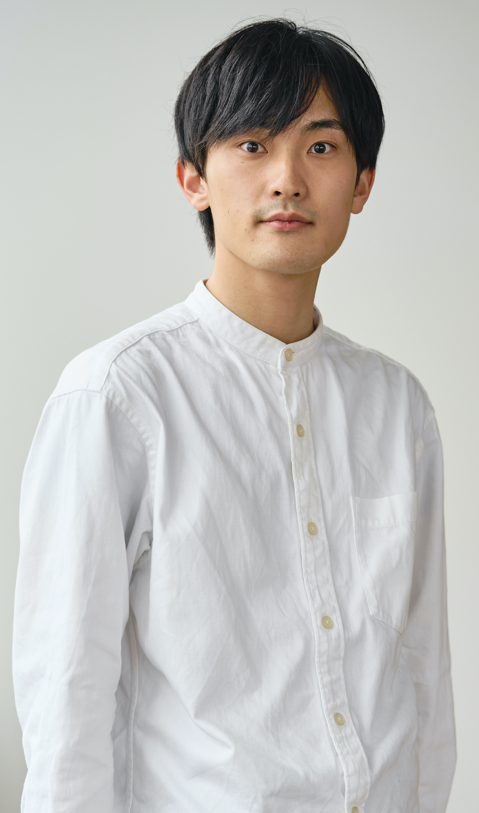
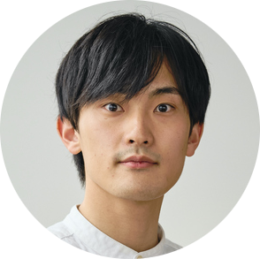

# Overview

  <!--  -->
  <!--  -->
  
  <!--  -->
  

  **My name is Tomoaki KOBAYASHI.**

  **Nice to meet you! 🤗**

  - SNS
    - [X](https://twitter.com/moatom)
    - [LinkedIn](https://www.linkedin.com/in/tomoaki-kobayashi)
    - [GitHub](https://github.com/moatom)
    - [Gist](https://gist.github.com/moatom)
  - JPN
    - [Blog](https://moatom.blogspot.com/)
    - [Qiita](https://qiita.com/moatom)
  - Misc.
    - [ORCID: 0009-0006-7147-9997](https://orcid.org/0009-0006-7147-9997)
  <!-- - **[Quora](https://www.quora.com/profile/Tomoaki-Kobayashi-1)** -->

  I am a software engineer with strong interest in research on software.

  My research interests focus on theoretical foundations of software and
  the application of them, especially in the following fields:

  - Programming languages
  - (Moderately) Functional programming
  - Embedded domain-specific languages, code generation, metaprogramming, partial evaluation

  My main research work is about [strymonas](https://strymonas.github.io/)---a
  lightweight declarative stream processing library which proposes *complete stream fusion*;
  its processing runs in constant memory!

  My vision is to provide solutions to real-world problems of software through these techniques.
  Software is often too fragile, and maintaining it consumes a tremendous amount of the world's resources unnecessarily.
  To protect humanity’s productivity, I will lead the way in building robust software—without ever sacrificing agility.

# Experience

Year| Company / Job
:-:|-:
2024--Present | [MicroAd, Inc.](https://jp.linkedin.com/company/microad-inc-) / Junior Software Engineer[^1]

[^1]: I primarily work on developing an auction-based internet advertising delivery system, commonly known as Real-Time Bidding (RTB). I have ever recieved monthly MVP twice in the Software Development Department.

# Academic

## Education

Year| Degree
:-:|-:
2022--2024 | **Master of Information Sciences in CS**, Tohoku University <small>GPA: 3.8[^2]/4.0, Advisor: [Eijiro Sumii](https://www.kb.ecei.tohoku.ac.jp/~sumii/), Thesis Advisor: [Oleg Kiselyov](https://okmij.org/ftp/)</small>
2018--2022 | **Bachelor of Engineering in CS**, Tohoku University <small>Major GPA: 3.73[^3]/4.0, Advisor: [Eijiro Sumii](https://www.kb.ecei.tohoku.ac.jp/~sumii/), Thesis Advisor: [Oleg Kiselyov](https://okmij.org/ftp/)</small>
2014--2015 | **Dropout**[^4], *An evening high school*
<!-- 2015        | Pass the Upper Secondary School Equivalency Examination -->
<!-- https://github.com/jgm/pandoc/issues/8139 -->

[^2]: Please note that GPAs tend to be graded strictly in Japan. As a side note, I was exempted from the written exam when I entered the graduate school.
[^3]: The same as 2.
[^4]: Instead, I earned a high school equivalency diploma issued by the Japanese government. *It was pretty scary at the time, but looking back, it was one of the best decisions I ever made.*

<!-- Detail: **[CV (pdf)](https://moatom.github.io/profile/static/cv-pub.pdf)** -->

## Publications

Only international publications are listed:

::: {#refs-moatom}
:::

## Awards

Year| Award
:-:|-:
2024 | ACM SIGPLAN PEPM 2024 Distinguished Paper Award ([image](./static/award-pepm24.jpeg))
2020 | [JPN] JSSST 2020 Best Presentation Award ([image](./static/award-jssst20.jpeg))

## Grants

- [ACM SIGPLAN Professional Activities Committee (PAC) Funding](https://pac.sigplan.org/) 2024: $1500

# Skills and Tools

### Professional Experience

- Scala, Python
- GitHub Enterprise, Makefile, Docker, Ansible, Jenkins
- Protocol Buffers, Niginx, MySQL, Redis, Akka, Apache Spark
- On-prem environment

### All in All

- Main Languages: Scala, OCaml, C, Python, JavaScript/Vue
  - Sub Languages: Kotlin, C++, Rust, Lua, Java
- Git, LaTeX, Valgrind, GitHub Actions
